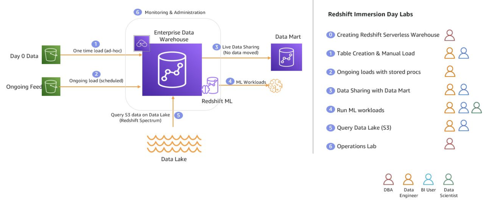
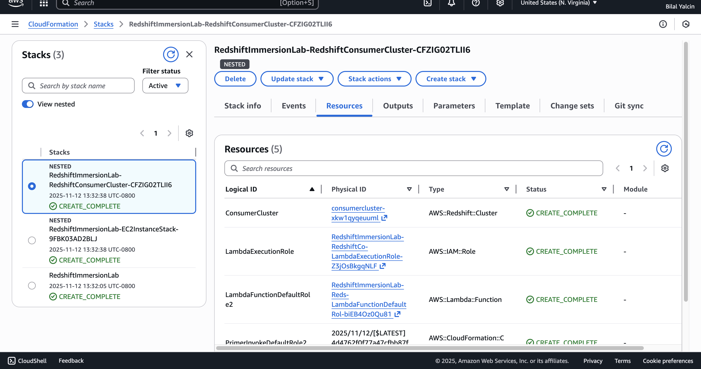
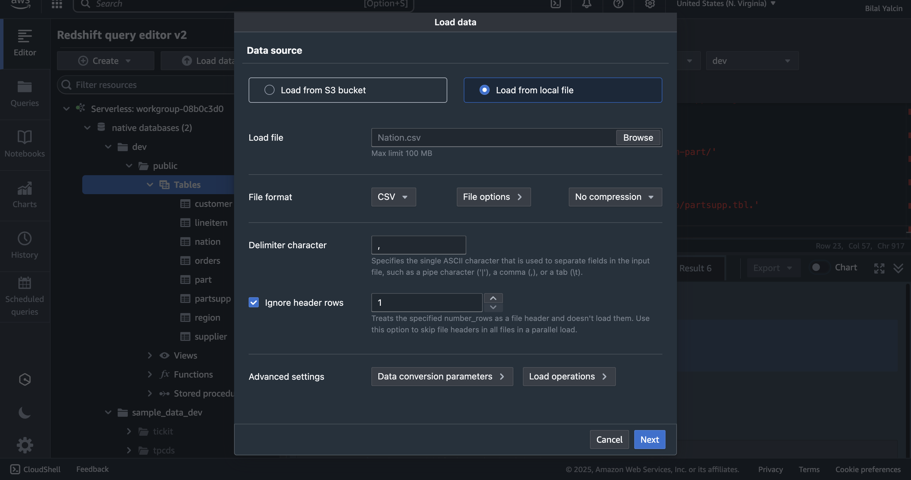
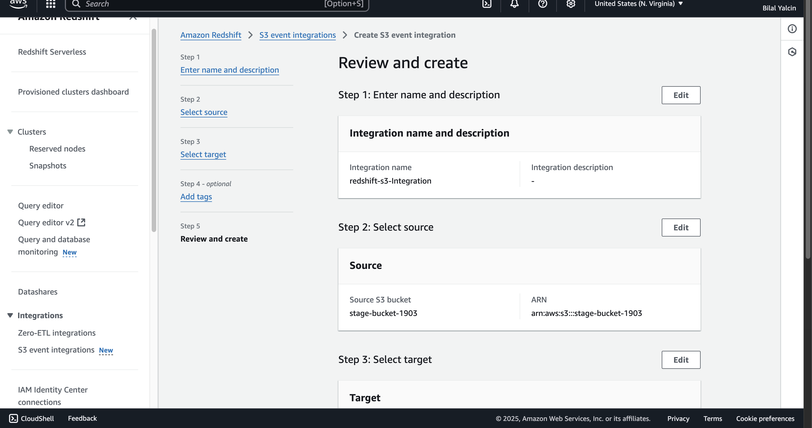
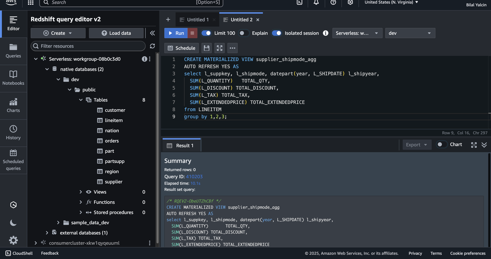
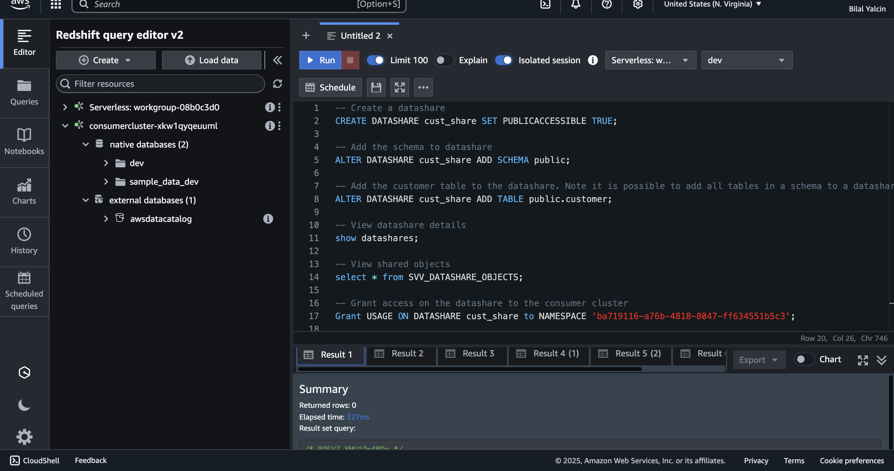
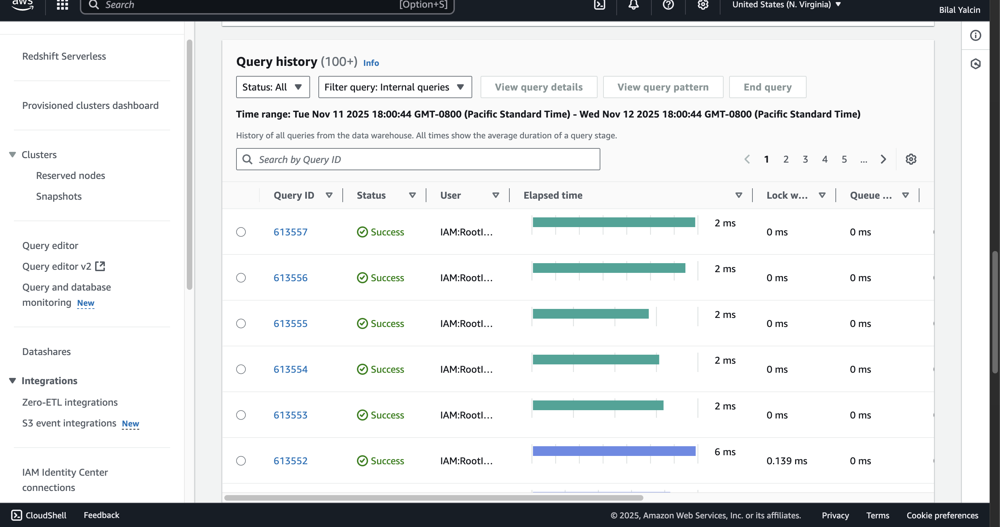
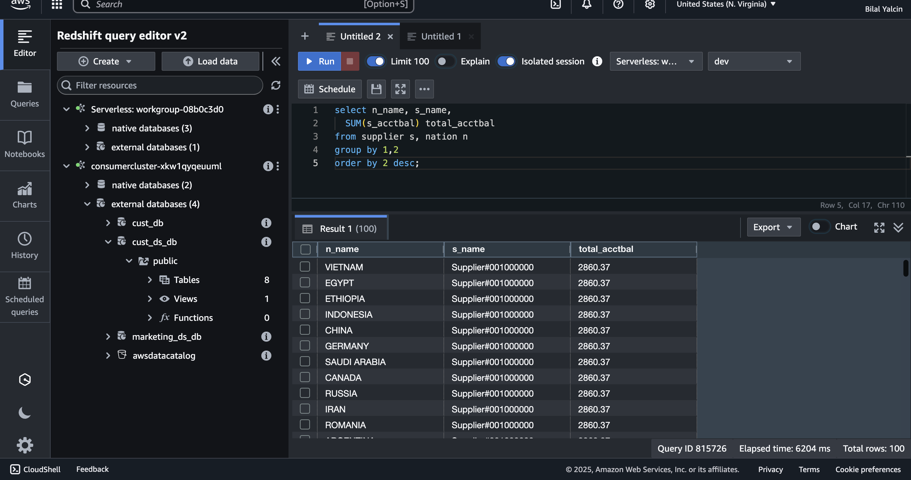

# 📘 Amazon Redshift Immersion Labs 
### *Hands-on Data Engineering Project*

This project is based on the **AWS Redshift Immersion Labs** workshop.  
It covers Redshift Serverless, ELT processes, COPY jobs, S3 event integrations, data sharing, and performance monitoring.

---

# 📌 Project Overview

The goal of this project was to gain real-world hands-on experience with **Amazon Redshift Serverless**, including:

- Table design and schema configuration  
- Loading data using COPY from S3 and local files  
- Automating ingestion using S3 event notifications  
- Creating COPY Jobs for ELT workflows  
- Creating and querying Materialized Views  
- Sharing data across Redshift consumers  
- Monitoring query performance and tuning  

---

# 🏗️ Architecture

This architecture includes:

- **Redshift Serverless** as the primary data warehouse  
- **Amazon S3** for raw file ingestion  
- **S3 Event Notifications** to automate ingestion  
- **COPY Jobs** for ELT  
- **Materialized Views** to speed up queries  
- **Data Sharing** for federated analytics  
- **Monitoring Tools** for performance tuning  

---

# 🟦 1. Environment Setup — CloudFormation

### **1.1 — CloudFormation Stack (Lab Start Page)**  

### **1.2 — Creating the CloudFormation Stack**

### **1.3 — CloudFormation Stack Created Successfully**

---

# 🟦 2. Connect to Redshift Query Editor v2

### **Redshift Query Editor Connected Successfully**

---

# 🟦 3. Table Design & Manual Data Loading

### **3.1 — Creating Tables**

### **3.2 — Loading Data from S3 Using COPY**

### **3.3 — Loading Data from Local File**

### **3.4 — Successful Local Ingestion**

### **3.5 — Example of Column Mismatch Error**

### **3.6 — Troubleshooting Data Load Issues**

---

# 🟦 4. ELT Workflow & Continuous Data Loads

### **4.1 — ETL Workflow Overview**

### **4.2 — ELT Workflow Overview**

### **4.3 — Updating S3 Bucket Policy**

### **4.4 — Redshift Resource Policies for S3 Event Integration**

### **4.5 — Creating S3 Event Integration**

### **4.6 — S3 Event Integration Completed**

### **4.7 — Creating a Redshift COPY Job**

---

# 🟦 5. Materialized Views

### **5.1 — Creating a Materialized View**

### **5.2 — Querying Data Using the MV**

---

# 🟦 6. Data Sharing Between Redshift Clusters

### **6.1 — Creating a Data Share**

### **6.2 — Creating Database from Data Share & Testing**

### **6.3 — Creating Additional User & Granting Permissions**

---

# 🟦 7. Query Monitoring & Performance Tuning

### **7.1 — Monitoring Dashboards**
  
  
  
  
  

### **7.2 — Deep Dive: Query ID Analysis**
  

---

# 🧹 Cleanup

To avoid unexpected charges:

1. Delete Redshift Serverless workgroup  
2. Delete CloudFormation stack  
3. Empty & delete S3 bucket  
4. Remove IAM roles (if manually created)  

---

# 🏁 Final Thoughts

This project significantly strengthened my understanding of:

- Redshift data loading strategies  
- ELT workflow automation  
- Serverless data warehousing design  
- Data sharing across analytics workloads  
- Redshift monitoring and performance tuning  

---

# 🎓 Skills Gained

✔️ COPY Command & bulk data ingestion  
✔️ Automated ELT with S3 Event Notifications  
✔️ COPY Jobs in Redshift Serverless  
✔️ Materialized Views for performance  
✔️ Data Sharing concepts  
✔️ Schema design & sorting/distribution keys  
✔️ Query performance monitoring  
✔️ IAM & S3 integration  
✔️ Redshift Serverless workflow experience  
